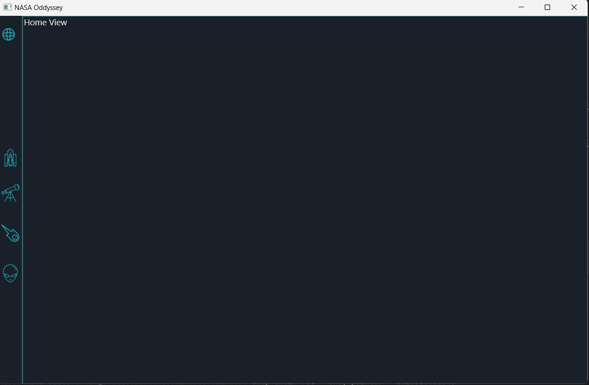
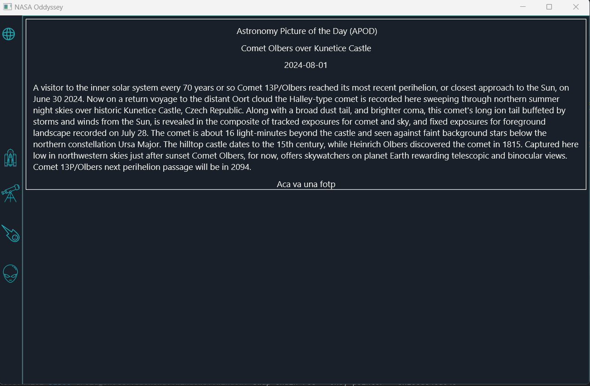

------ENGLISH-------

# NASA ODYSSEY

NASA ODYSSEY is a desktop application written in Rust using the Druid framework for the graphical user interface. This application allows users to explore various NASA APIs, providing an interactive and educational experience about space and astronomy.

## Features

- **Space Launches**: View information about upcoming space launches and their details.
- **Photo of the Day**: Discover the stunning "Photo of the Day" selected by NASA.
- **Rover Photos**: Explore images captured by the rovers on Mars.
- **Near-Earth Objects**: Get data on asteroids and other objects approaching Earth.

## Technologies Used

- **Programming Language**: Rust
- **GUI Framework**: Druid

------SPANISH-------

# NASA ODYSSEY
NASA ODYSSEY es una aplicación de escritorio escrita en Rust utilizando el framework Druid para la interfaz gráfica de usuario. Esta aplicación permite a los usuarios explorar diversas APIs de la NASA, proporcionando una experiencia interactiva y educativa sobre el espacio y la astronomía.

## Características
- **Lanzamientos Espaciales**: Consulta información sobre los próximos lanzamientos espaciales y sus detalles.
- **Foto del Día**: Descubre la impresionante "Foto del Día" seleccionada por la NASA.
- **Fotos del Rover**: Explora las imágenes capturadas por los rovers en Marte.
- **Objetos Cercanos a la Tierra**: Obtén datos sobre los asteroides y otros objetos que se acercan a la Tierra.

## Tecnologías Utilizadas
- **Lenguaje de Programación**: Rust
- **Framework de GUI**: Druid
- 

## NASA API 
https://api.nasa.gov/
- **Space Launches**: https://ll.thespacedevs.com/2.2.0/launch/  AND https://ll.thespacedevs.com/2.2.0/swagger/
- **Photo of the Day**:GET  https://api.nasa.gov/planetary/apod?api_key=DEMO_KEY
- **Rover Photos**: https://api.nasa.gov/mars-photos/api/v1/rovers/curiosity/photos?sol=1000&page=2&api_key=DEMO_KEY
- **Near-Earth Objects**: GET https://api.nasa.gov/neo/rest/v1/feed?start_date=START_DATE&end_date=END_DATE&api_key=API_KEY

## ShowCase

